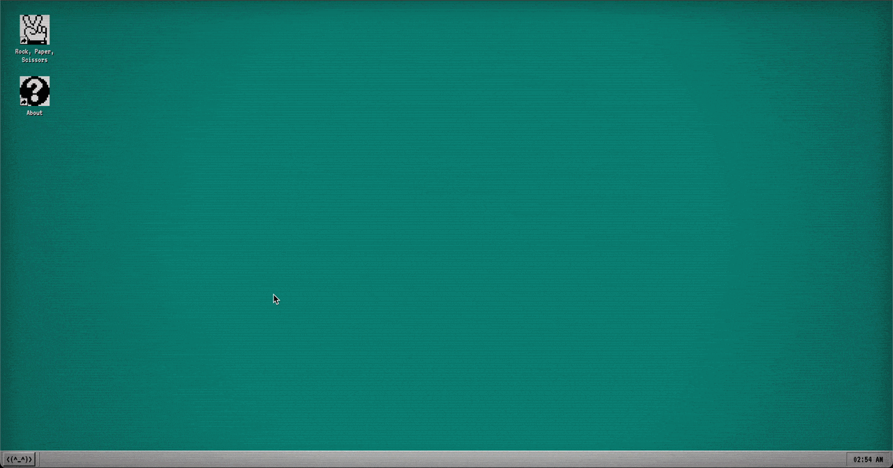

# Retro Web OS & Rock Paper Scissors

A functional, browser based Retro desktop environment, built from scratch using **Vanilla JavaScript, HTML and CSS**.

This project is an exercise as part of [The Odin Project](https://www.theodinproject.com/). It evolved into a comprehensive study of DOM manipulation, event-driven architecture, and UI state management.

**[Live Demo: Explore the OS here!](https://strecke.github.io/rock-paper-scissors/)**

## Features
* The JavaScript code is modularized into dedicated objects to separate the UI logic from event handling.
* The OS communicates via an event bus to decouple window from application logic.
* Windows dynamically adjust their Z-Index when focused.
* Custom physics logic to drag windows and desktop items, including ghost-element rendering during mouse movement.
* Desktop items can be renamed inline.
* Simulated user sessions with customizable usernames.
* Custom Lasso Tool and multi-select group dragging.
* Rock, Paper, Scissors featuring progress bars, localStorage API for saving game history and statistics tables.

## Local Setup
Since this project uses Vanilla JS, HTML, and CSS, no build steps are required.
Simply clone the repository and open **index.html** in your browser or run a local server.

## Credits
* W98 visual inspiration influenced by [Jordan Scales 98.css](https://github.com/jdan/98.css).
* Icons provided by [Streamline](https://www.streamlinehq.com/), [Phosphor](https://phosphoricons.com/), and [Pixel Icon Library](https://pixeliconlibrary.com/).
* Retro typography via the [VT323 Font by Peter Hull](https://github.com/phoikoi/VT323/).
* Sound effects by [Pixabay](https://pixabay.com/) and [sfxr](https://pro.sfxr.me/).
* Emulation references from [Fabians v86](https://copy.sh/v86/?profile=windows98).